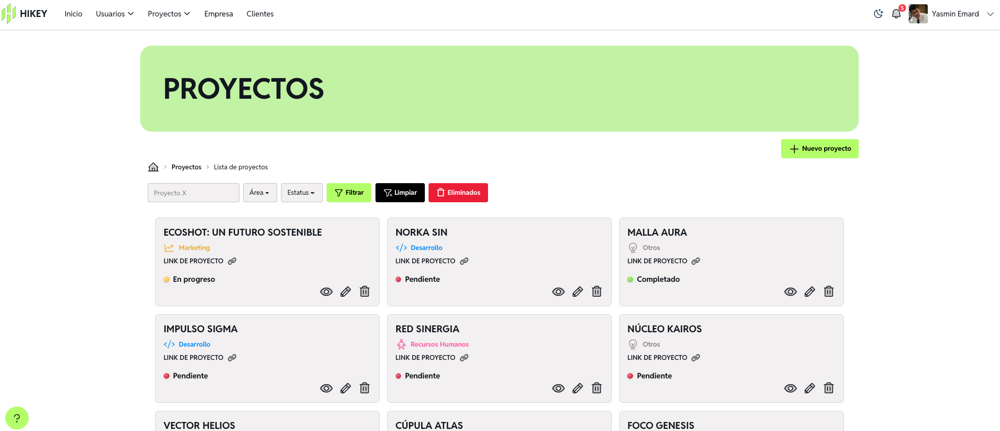
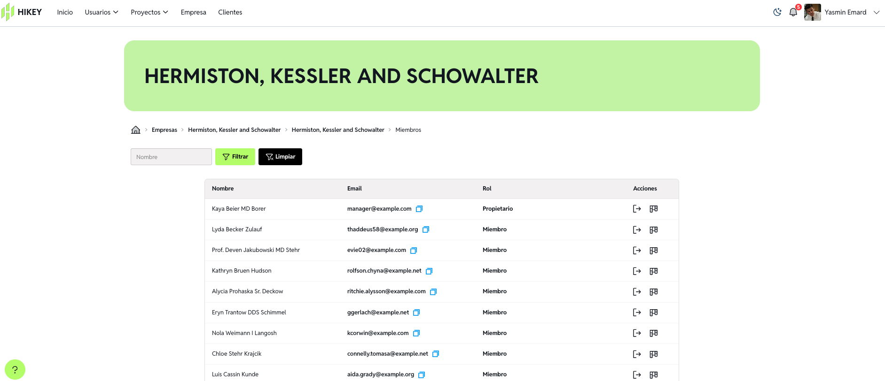
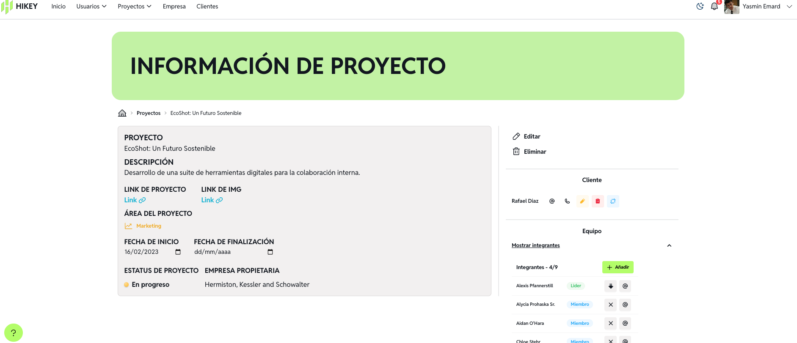
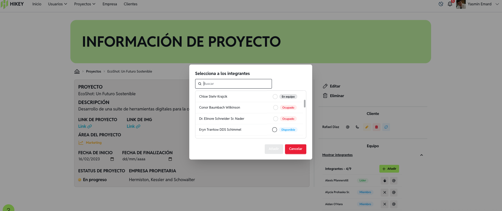
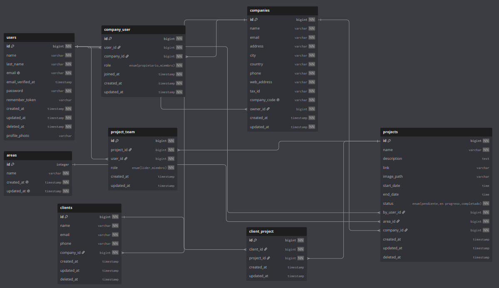

<p align="center">
  
</p>

---

## Descripción

***Hikey*** busca facilitar el acceso de equipos pequeños, emprendimientos y grupos académicos a una herramienta de organización que permita visualizar responsabilidades, disponibilidad y carga de trabajo antes de asignar nuevas actividades.

Esto ayuda a reducir concentraciones innecesarias de trabajo, mejorar la transparencia en la distribución de tareas y apoyar una planeación más equitativa dentro de los equipos.

## Objetivo
Desarrollar una plataforma web que permita a equipos pequeños, emprendimientos y grupos académicos gestionar proyectos, usuarios y clientes de forma centralizada, con visibilidad clara sobre la carga de trabajo de cada integrante.

## Arquitectura y tecnologías

#### Backend

- PHP 8.4
- Laravel 12 - framework de PHP para logica, rutas y controladores
- Laravel Spatie Permission - gestion de roles y permisos
- MariaDB - base de datos relacional

#### Frontend

- Vue 3 - framework de interfaz de usuario
- Inertia.js - conecta Laravel y Vue sin necesidad de una API REST separada
- Vite - bundler y servidor de desarrollo
- Tailwind CSS - estilos de interfaz
- DaisyUI - componentes de interfaz

#### Infraestructura

- Docker - contenedores para desarrollo
- Redis - manejo de trabajos en segundo plano
- Mailpit - servidor de correo para pruebas de desarrollo

#### Testing

- Pest - framework para testing de PHP

## Roles de sistema

| Rol | Descripción |
|----------|--------|
| Administrador | Responsable de gestionar todas las actividades del sistema, así como de administrar y supervisar a los usuarios. |
| Manager | Responsable de gestionar todas las actividades de proyectos, gestión de equipos y realizar seguimiento del progreso. |
| Líder de equipo | Responsable de organizar las tareas de equipo, gestionar tareas y monitorear el avance. |
| Usuario | Responsable de ejecutar las tareas asignadas y actualizar el estado de las tareas del proyecto. |

## Características implementadas

#### Gestión de usuarios y cuentas 
- Registro y autentificación de usuarios
- Verificación de correo de usuarios
- Cambio de contraseña
- Cambio de foto de perfil de usuario
- Edición de información de cuenta (nombre, apellido, correo)
- Eliminación de cuenta
- Recuperación de cuentas
- Sistema de roles y permisos con spatie 

#### Gestión de empresas
- Registro de empresas
- Asignación automática de rol *Manager* al crear empresa
- Unirse a empresa con código único
- Edición de información de empresa
- Invitación de nuevos miembros a empresa
- Listado de miembros de empresa con filtrado
- Visualización de en qué proyectos participa cada miembros
- Sacar a miembros de la empresa
- Eliminación de empresa

#### Gestión de proyectos 
- Creación, edición y eliminación de proyectos
- Asignación de área y empresa a un proyecto
- Edición de fechas de proyecto
- Control de acceso por Gates/Policies sobre quien puede ver el proyecto
- Notificación al propietario cuando se haga una modificación al proyecto

#### Gestión de clientes
- Creación y vinculación de clientes a proyectos
- Listado de proyectos que pertenezcan a cliente
- Notificación al propietario del proyecto cuando se asigna un cliente

#### Gestión de equipos
- Asignación de miembros a un proyecto (equipo)
- Asignación de líder a proyecto 
- Remover a miembros de equipo
- Sincronización de rol de *Líder de equipo* al asignar o quitar líder
- Notificación al usuario cuando es nombrado líder, asignado o removido de equipo

## Imágenes
<p align="center">
  
  
  
  
</p>

## Modelo de datos
<p align="center">
  
</p>

## Instrucciones de instalación

1. Clona el repositorio:

```bash
git clone https://github.com/tu-usuario/hikey.git
cd hikey
```

2. Copia el archivo de entorno:

```bash
cp .env.example .env
```

3. Levanta los contenedores con Docker Compose:

```bash
docker compose up -d
```

4. Instala las dependencias de PHP:

```bash
docker compose exec php composer install
```

5. Genera la clave de la aplicación:

```bash
docker compose exec php php artisan key:generate
```

6. Corre las migraciones y seeders:

```bash
docker compose exec php php artisan migrate --seed
```

7. Instala las dependencias de Node:

```bash
docker compose run --rm npm install
```
8. Reinicia los contenedores:

```bash
docker compose down
docker compose up -d
```

## Pruebas

El proyecto utiliza [Pest](https://pestphp.com/) como framework de testing para PHP.Para ejecutar las pruebas, el proyecto debe estar corriendo con Docker Compose:

```bash
docker compose up -d
```
Luego, ejecuta las pruebas dentro del contenedor de PHP:

```bash
docker compose exec php ./vendor/bin/pest
```


También puedes ver el estado de las pruebas en tiempo real a través del badge de GitHub Actions:


### Ejecutar una prueba puntual por nombre

```bash
docker compose exec php ./vendor/bin/pest --filter="nombre del test"
```

## Estado actual y limitaciones conocidas

El proyecto se encuentra actualmente en fase de desarrollo. Algunas de las limitaciones y trabajo pendiente incluyen:

- El módulo de actividades de usuario aún no está desarrollado.
- Es necesario fortalecer la seguridad del sistema (validaciones adicionales, manejo de sesiones, entre otros).
- Está en evaluación cómo incorporar un componente de Machine Learning al proyecto (por ejemplo, análisis o agrupamiento de datos).

## Roadmap

### ✅ Fase 1 — Fundamentos (completado)
- Autenticación y gestión de usuarios
- Sistema de roles y permisos
- Gestión de empresas y equipos

### ✅ Fase 2 — Gestión de proyectos (completado)
- CRUD de proyectos
- Asignación de equipos y líderes
- Vinculación de clientes a proyectos

### 🔄 Fase 3 — Refinamiento y seguridad (en progreso)
- Fortalecimiento de validaciones y seguridad
- Cobertura de pruebas automatizadas
- Módulo de actividades de usuario

### 🔜 Fase 4 — Escalabilidad (planeado)
- Notificaciones en tiempo real (Laravel Reverb)
- Procesamiento en segundo plano con colas (Redis)
- Despliegue en la nube

### 💡 Fase 5 — Análisis de datos (en evaluación)
- Incorporación de Machine Learning para análisis de carga de trabajo / segmentación
